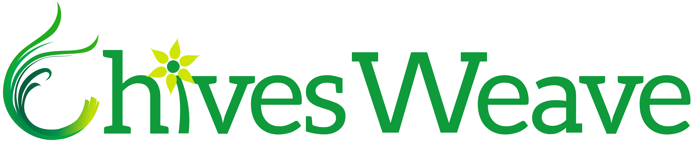

# Chivesweave Wallet

## Link

https://wallet.chivesweave.org

## Features

- Local-first, self-custodial wallet
- Create / Import / Export wallets by passphrase or key file
- Ledger support (awaiting release on Ledger app store)
- Send and receive XWE tokens
- Upload permanent data (text, files, folders, deploy static websites)
- View transactions and data

## Open standards

### Identity

Profile data is hosted permanently on the weave. To represent user profile for a specific address, the latest transaction using the tag `App-Name: chivesweave-id` is selected and the following tag values are displayed:

User info
- `Name: string` Username
- `Text: string` Bio

Profile picture
- `Image: TxId` ID pointing to the data (if a transaction containing the image data was posted independently)
- `Content-Type: image/png | image/svg | ...` MIME type tag (included with the transaction containing the image data)
